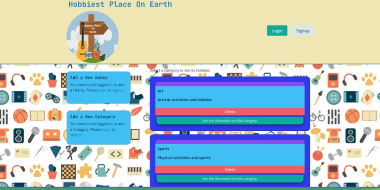
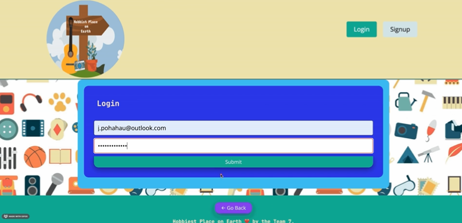
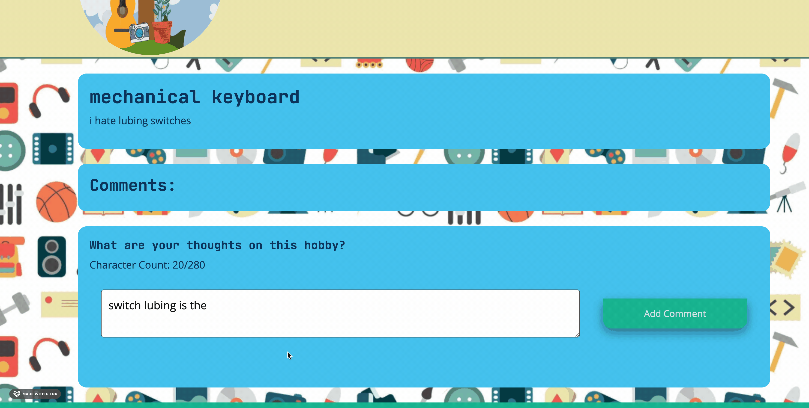
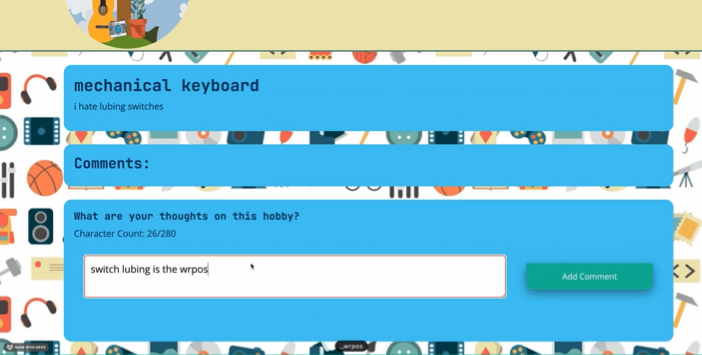
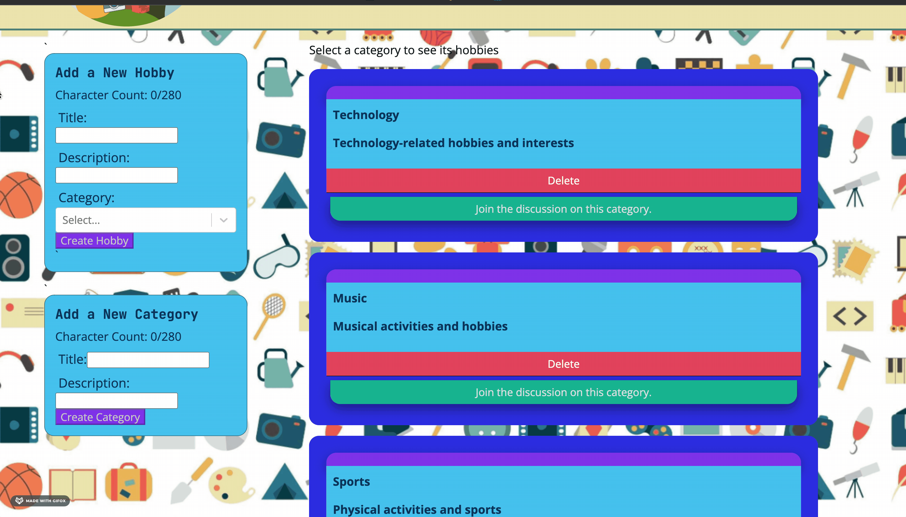
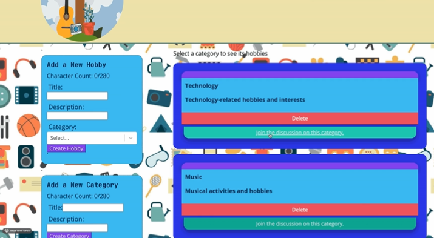
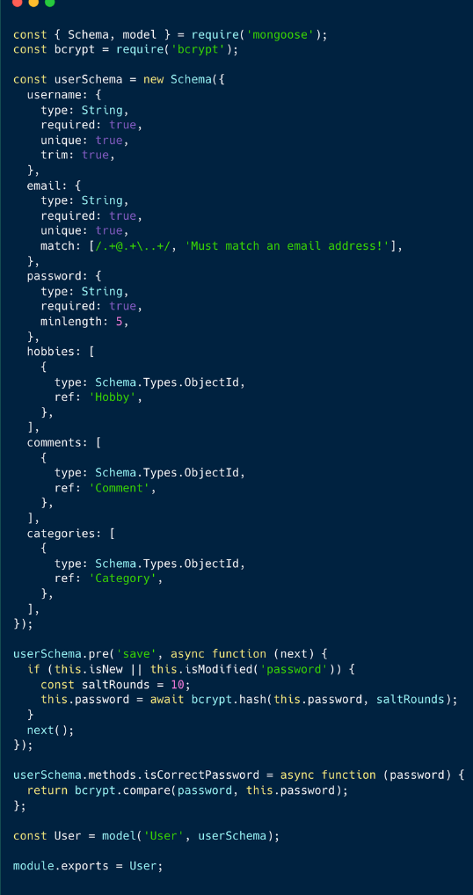
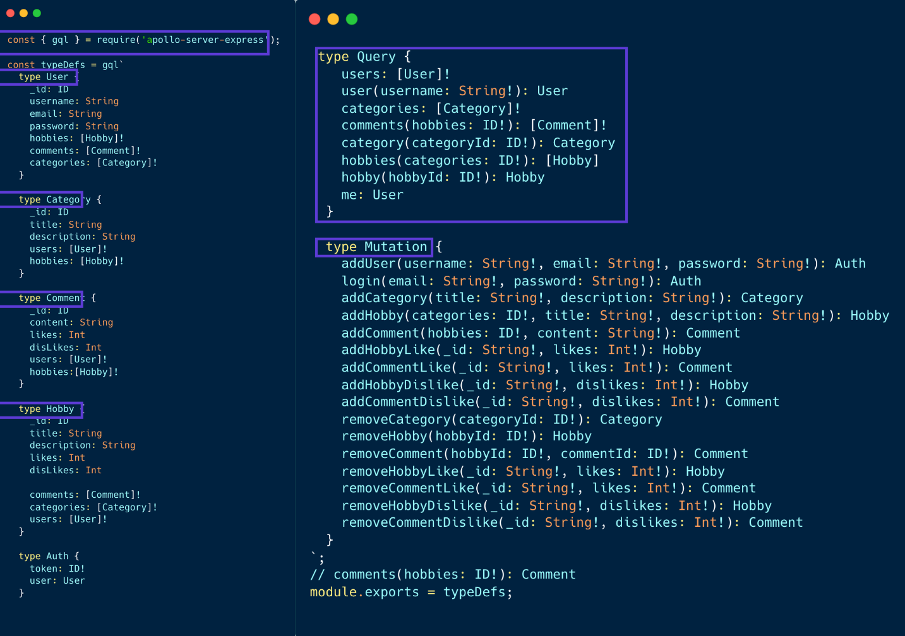
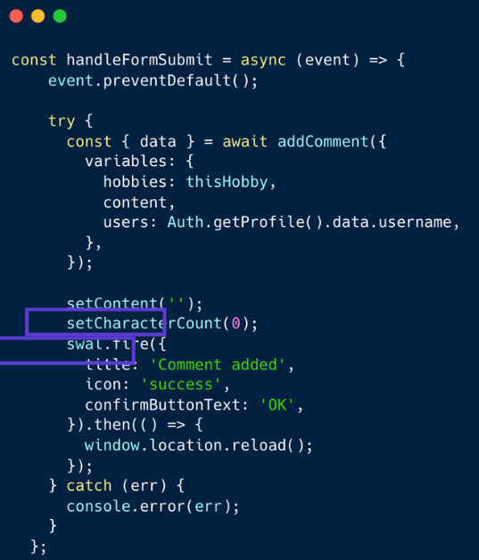
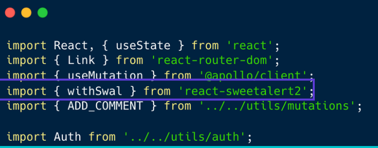

# Hobbist-Place-on-Earth

## Description 📖

MERN-stack single-page application, with a scalable MongoDB back end, a GraphQL API, and an Express.js and Node.js server with a React front end, implementing user authentication with JWT to build a user-focused platform.

## Getting Started 💃

Create a Interactive MERN Stack Single-Page Application with the following features:

✅Use React for the front end.

✅Use GraphQL with a Node.js and Express.js server.

✅Use MongoDB and the Mongoose ODM for the database.

✅Use queries and mutations for retrieving, adding, updating, and deleting data.

✅Be deployed using Heroku (with data).

✅Have a polished UI.

✅Be responsive.

✅Be interactive (i.e., accept and respond to user input).

✅Include authentication (JWT).

✅Protect sensitive API key information on the server.

✅Have a clean repository that meets quality coding standards (file structure, naming conventions, best practices for class and id naming conventions, indentation, high-quality comments, and so on).

✅Have a high-quality README (with unique name, description, technologies used, screenshot, and link to deployed application).

# User story ✏️

№1

AS A USER  if I am not logged in 
I WANT to be able to look at a list of hobbies -OR-view a list of a hobby categories SO I MAY read about them.

 

 

№2

AS A USER I have an option to login or signUp BECAUSE  
I WANT to  build 
a profile so that through my account I may add categories and hobbies that become associateD with my profile.

№3

AS A USER when I’m logged in 
I WANT to ADD commentS TO other hobbies so that I may share my experienceS with others.

№4
AS A USER when I’m logged in 
I WANT to JOIN AN EXISTING HOBBY

# Built With ⚙️

|Technology | Resource |
|-----|:-----------|
| Mongodb | [Mongodb](https://www.mongodb.com/) |

| Express | [Express](https://expressjs.com/) |

| React | [React](https://react.dev/) |

| Nodejs | [Nodejs](https://nodejs.org/en) |

| Graphql | [Graphql](https://graphql.org/) |

| Heroku | [Heroku](https://id.heroku.com/login) |

| TailwindCSS | [Tailwind](https://tailwindcss.com/) |

| Mongoose |[Mongoose](https://www.npmjs.com/package/mongoose) |

| SweetAlerts2 | [Sweetalerts](https://sweetalert2.github.io/) |

| Coolors | [Coolors](https://coolors.co/) |

# Code snippets

## Models:

user as example:

Model associations / relationships

user has

many hobbies
many likes
many comments

The user schema defines a user object with the following fields:

username: A required string that is unique and trimmed.

email: A required string that is unique and matches an email address pattern.

password: A required string with a minimum length of 5 characters.

hobbies: An array of object IDs referencing Hobby objects.

comments: An array of object IDs referencing Comment objects.

categories: An array of object IDs referencing Category objects.

## Type-defs:

The typeDef.js file in our schema defines the GraphQL schema for an application that involves users, categories, hobbies, and comments.

It uses the gql function from apollo-server-express to define the schema using GraphQL's type definition language.

The schema includes four main types: User, Category, Comment, and Hobby. Each of these types has a set of fields that define the data that can be queried or mutated.

The Query type defines the queries that can be executed to retrieve data from the application. The available queries include users, user, categories, comments, category, hobbies, hobby, and me.

The Mutation type defines the mutations that can be executed to modify data in the application. There are 16 available mutations, SUCH AS 

## Sweetalert2:

This code snippet displayed is using the withSwal higher-order component (HOC) from the react-sweetalert2 library.

Higher-order components are functions that take a component and return a new component with additional functionality. withSwal is a HOC that adds SweetAlert2 functionality to a component. 

We used REACT-Sweetalert2 "v.0.5.2" in order to get alerts rendered on teh client side of our REACT app "v.17.0.1"

The REACT app gets imported at the top of the javascript page that it gets used on as a hoc. The await swal then starts a timer once something is removed and then renders an alert saying 'successfully delete'. 

# Installation 🤖

To install the project follow these steps:

💾 Clone down project repo

In the project directory, you can run:

🏃-npm install

🏃-npm run build

Builds the app for production to the build folder.
It correctly bundles React in production mode and optimizes the build for the best performance.

The build is minified and the filenames include the hashes.
Your app is ready to be deployed!

🏃-npm run develop

# Usage & Installation 🤖

The URL of the functional, deployed application(heroku)

The URL of the GitHub repository. Give the repository a unique name and include a README describing the project

https://github.com/j-pohahau5/Hobbist-Place-on-Earth

## Authors 💣

** OUR TEAM **  

💻- [Alex Horning](https://github.com/makeitouthill)

💻- [Emil Ronquillo](https://github.com/Emil1577)

💻- [Henner Espinoza](https://github.com/justhenner)

💻- [Jonathan Pohahau](https://github.com/j-pohahau5)

💻- [Roksolana Odynak](https://github.com/poucoLouco)

# License 📑

